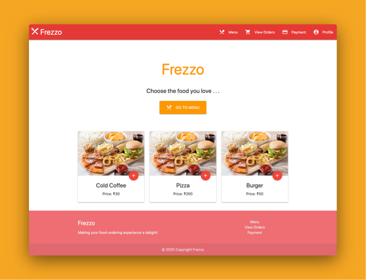
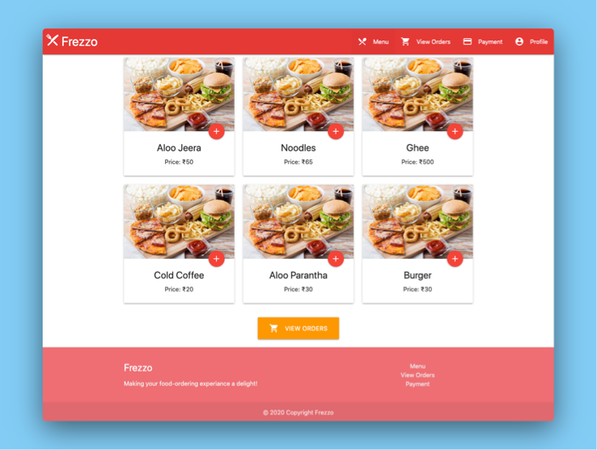
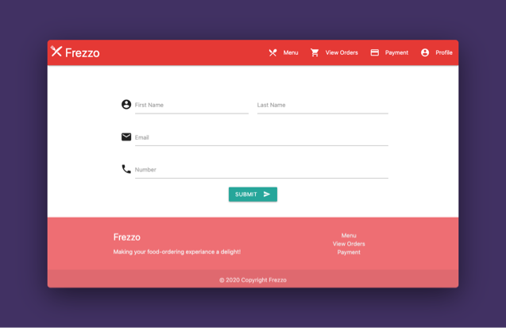

# Frezzo

Frezzo is online food ordering and delivery platform.

## Project setup

```
npm install
```

### For development server

```
ng serve -o
```

## Features

- Material design
- Push notifications
- Client side state management
- Responsive design

## Screenshots





## Built With

- [Angular](https://angular.io/) - One framework. Mobile & desktop.
- [Materialize](https://materializecss.com/) - A modern responsive front-end framework based on Material Design
- [Firebase](https://firebase.google.com/) - Firebase helps mobile and web app teams succeed

## Contributing

Currently not accepting any contributions.

## Authors

- **Pulkit Banta** - _Initial work_ - [PulkitBanta](https://github.com/PulkitBanta/)